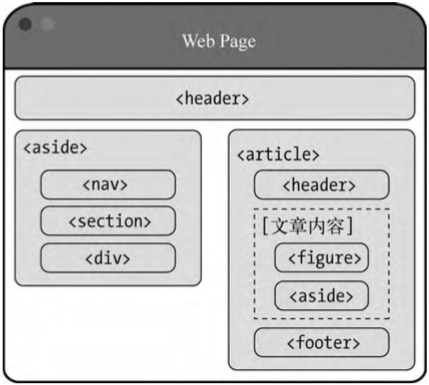

## DAY1

摘要:

HTML5, 语义元素(semantic element), 好多新的HTML5的新元素和控件等.

材料:

<<HTML5秘籍>>Chapter1-Chapter4;(源代码http://prosetech.com/html5/)

## Chapter1:关于HTML5

HTML5支持所有的HTML, 包括很多被认为是废弃的功能, 其中包括`<blink><marquee>`. 这是由于HTML5不破坏web的原则的这种无所不包的开放性. 所以说HTML5规范包含两个独立的部分. 

一: 面向web开发者, 要求摒弃过去的那些坏习惯和被废弃的元素. 

二:针对浏览器开发商, 支持HTML中的一切, 做到向后兼容.

那既然HTML5是一门这样的活语言, 为什么还要加<!DOCTYPE html>这样的声明呢? 这是由于历史原因, 没有这个声明的话会转到混杂模式(quirk mode). 有声明就是标准模式(standard mode).

#### 部分元素说明

- `<small>`: 表示附属细则. 比如页面底部的法律条款.
- `<s>`: 表示不再准确或不再相关的内容;
- `
`: 表示主题的转换, 从一个主题转到另一个主题;
- `<strong>`: 表示重要的文本内容
- `<mark>`: 突出显示.
- `<b>`: 表示粗体, 但是该文本并不比其他文本更重要. 比如, 关键字, 产品名称等所有需要粗体的文本.
- `<em>`: 表示重读的文本. 就是朗读的时候要大声的读出来.
- `<i>`: 斜体, 但是并不比其他文字更重要, 比如外文单词, 技术术语.
- `<address>`: 提供作者联系信息.
- `<cite>`: 创建一个引用标记, 用于文档中参考文献的引用说明, 如书名,文章名称. (被标记的内容将以斜体呈现)

书本之后还会有.

## Chapter2: 使用语义元素构造网页

语义元素. 能发挥与div一样的作用, 却能传达出更多的语义. 比如: `<time><nav><footer>`等

优点: 易于修改和维护; 无障碍性(Accessibility)(比如Apple的voiceover, 科技, 为了每一个人); 搜索引擎优化;

一个基本的语义化的HTML写的页面:

article还可以用一个main包含起来.

关于HTML5的纲要机制, 两个要点:1. 每次遇到编号标题元素, 只要该元素不在某个区块顶部, 就会为它自动创建一个新的区块. 2. 如果一个区块的元素排在(举个栗子)`<h4>`后面, 那么区块中第一级标题从逻辑上就像`<h5>`一样

又想到Safari的阅读模式这个功能, 一开始是以为是根据页面article之类的标签识别的, 后来搜索了解一下, 跟标签没有关系, txt文件也能触发阅读模式. 触发阅读模式关键有两点: 文字数量和屏幕分辨率的组合. 文字达到一定数量, 屏幕的分辨率越低, 需要的文字数量越少.

## Chapter3: 编写更有意义的标记

文本级语义,time output mark

ARIA(Accessible Rich Internet Application). RDFa. 微格式. 了解一下

微数据.  itemscope. itemprop. 增强搜索效果. 一些插件可以实现提取信息.

(都是细节. 直接看书比较好)

## Chapter4: 构建更好的web表单

用好占位符 (placeholder);

autofocus

表单验证 在客户端一次 在服务端一次.(在前端的验证逻辑都是暴露的,要注意)

Input新的type:

- color
- date
- range
- number
- tel
- search
- url
- email

新元素:

- `<datalist>`
- `<meter>`
- `<progress>`

可编辑的HTML.

## DAY1总结

使用现代的标签. 不然未来就会pass you by.

觉得原生的HTML越来越多, 细节也多, 感觉很强大.

现在HTML到了5.2了, 有了原生的dialog元素和在iframe中使用支付请求API

一天接触了太多新标签, 知道有这么个东西, 用的时候再细用.

